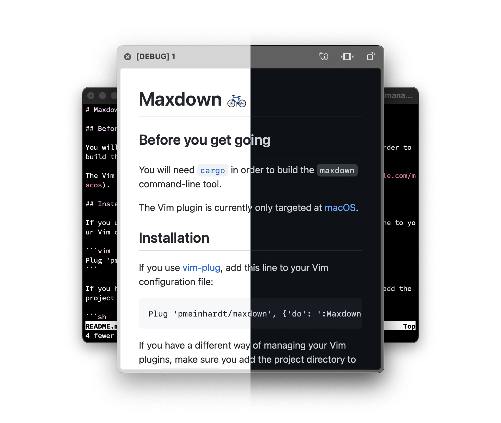

# Maxdown 🚲

[](https://github.com/pmeinhardt/maxdown/actions/workflows/build.yml)

Maxdown is a simple and fast Markdown-to-HTML converter. It comes with a command-line interface and an integration for (Neo)Vim.



## Before you get going

You will need [`cargo`](https://doc.rust-lang.org/cargo/index.html) in order to build the `maxdown` command-line tool.

In case you are using [Homebrew](https://brew.sh/), it should be as easy as `brew install rust`.

## Installation

If you're only interested in the `maxdown` command-line tool, you can build it by running:

```shell
cargo build --release --locked
```

Then, just put the resulting `target/release/maxdown` binary somewhere on your `PATH`.

---

For the Vim plugin, if you use [vim-plug](https://github.com/junegunn/vim-plug), add this line to your Vim configuration file:

```vim
Plug 'pmeinhardt/maxdown', {'do': ':MaxdownCompile'}
```

If you have a different way of managing your Vim plugins, make sure you add the project directory to your `runtimepath` and build the command-line tool:

```sh
cargo build --release --locked
```

Or, to build from within Vim:

```
:MaxdownCompile
```

## Usage

The plugin does not define any mappings by default. You can invoke `:MaxdownPreview` from within a Markdown buffer or define a custom mapping.

For instance:

```vim
autocmd FileType markdown nnoremap <buffer> <localleader>m <Plug>MaxdownPreview
```

This will create a normal-mode mapping to preview the current markdown buffer.

## Enhancements

When the `ql` [Vim plugin](https://github.com/pmeinhardt/ql) is loaded, previews on macOS will look more neat (no `[DEBUG]` in the title):

```vim
Plug 'pmeinhardt/ql', {'do': ':QuickLookCompile'}
```

## Thanks

Maxdown is built on top of the impressive work of other people:

- markdown-rs: https://github.com/wooorm/markdown-rs
- trycmd: https://github.com/assert-rs/trycmd
- github-markdown-css: https://github.com/sindresorhus/github-markdown-css
