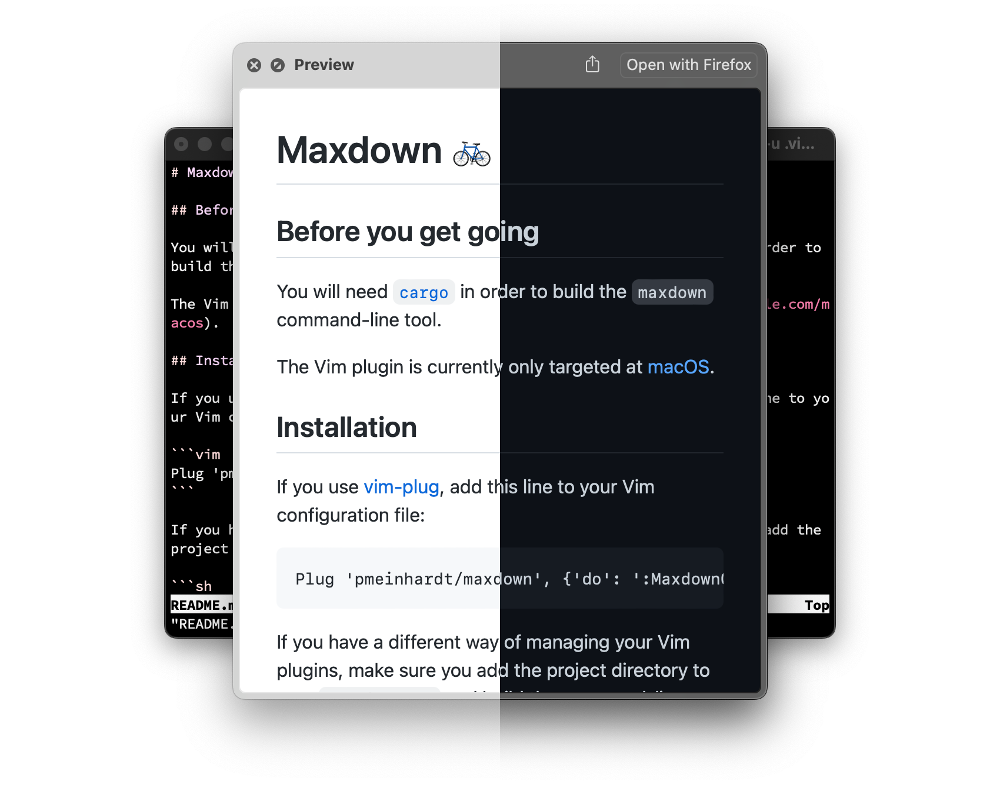

# Maxdown 🚲

[](https://github.com/pmeinhardt/maxdown/actions/workflows/build.yml)



## Before you get going

You will need [`cargo`](https://doc.rust-lang.org/cargo/index.html) in order to build the `maxdown` command-line tool.

In case you are using [Homebrew](https://brew.sh/), it should be as easy as `brew install rust`.

## Installation

If you use [vim-plug](https://github.com/junegunn/vim-plug), add this line to your Vim configuration file:

```vim
Plug 'pmeinhardt/maxdown', {'do': ':MaxdownCompile'}
```

If you have a different way of managing your Vim plugins, make sure you add the project directory to your `runtimepath` and build the command-line tool:

```sh
cargo build --release --locked
```

Or from within Vim:

```
:MaxdownCompile
```

## Usage

The plugin does not define any mappings by default. You can invoke `:MaxdownPreview` from within a Markdown buffer or define a custom mapping.

For instance:

```vim
autocmd FileType markdown nnoremap <buffer> <localleader>m <Plug>MaxdownPreview
```

This will create a normal-mode mapping to preview the current markdown buffer.

## Enhancements

When the `ql` [Vim plugin](https://github.com/pmeinhardt/ql) is loaded, previews on macOS will look more neat (no `[DEBUG]` in the title):

```vim
Plug 'pmeinhardt/ql', {'do': ':QuickLookCompile'}
```

## Using via WebAssembly

To compile to WebAssembly, use [wasm-pack](https://rustwasm.github.io/docs/wasm-pack/introduction.html):

```sh
wasm-pack build <options> -- --features wasm
```

E.g. to build the web preview app, run:

```sh
wasm-pack build --target web -- --features wasm
cd web && python3 -m http.server 3000
```

Then:

```sh
open "http://localhost:3000/?src=https://raw.githubusercontent.com/pmeinhardt/maxdown/main/README.md"
```

## References

- markdown-rs: https://github.com/wooorm/markdown-rs
- github-markdown-css: https://github.com/sindresorhus/github-markdown-css
